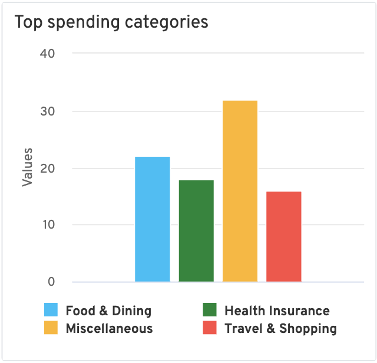

# Highcharts Demo

A simple example to demonstrate Highcharts capabilities.

## Visual Design

**Pie Chart**


**Pie Selected**


**Column Chart**



### Specifications

-   Chart size: 320 x 320 px
-   Donut diameter: 152px
-   Font family: Overpass
-   Font sizes:
    -   General: 12px
    -   Title: 16px
    -   Total count: 32px

## Getting Started

Execute the following commands to build and run the example.

```bash
$ yarn
$ yarn start
```

Now point your browser to http://localhost:3000/.
